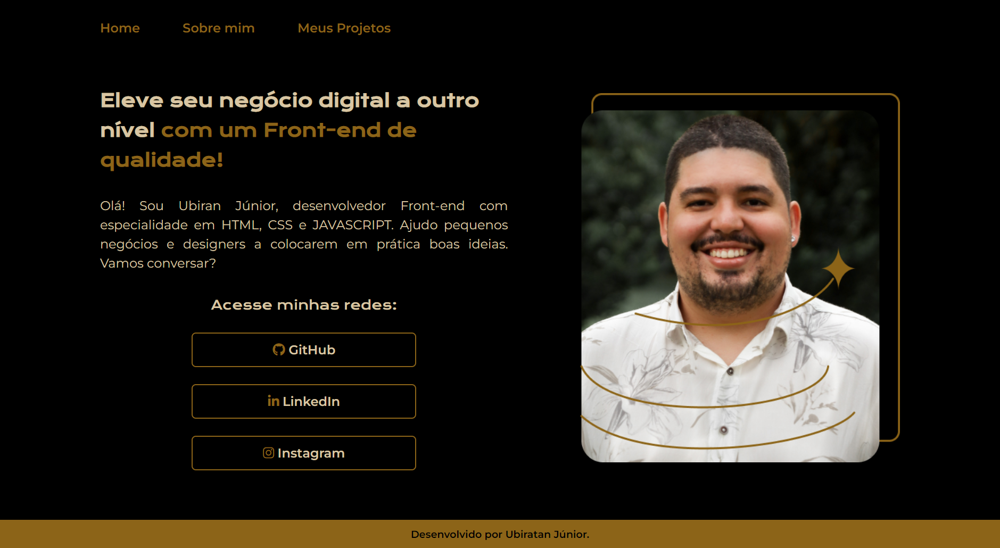

Projeto desenvolvido durante a formação A partir do zero: HTML e CSS para projetos web realizado na <a href="https://www.alura.com.br">Alura.</a>

  <a href="#-tecnologias">Tecnologias</a>     |    
  <a href="#-projeto">Projeto</a>     |    
  <a href="#-layout">Layout</a>     |    

  

 

  

## 🚀 Tecnologias

Esse projeto foi desenvolvido com as seguintes tecnologias:

- HTML
- SASS
- JavaScript

## 💻 Projeto

O projeto apresenta uma página de portfólio contendo as seções "Home", "Sobre Mim" e "Meus Projetos". Durante o curso, foi fornecido o layout para a página inicial (home) e a seção "Sobre Mim", bem como uma versão responsiva mais genérica. Com base nas ideias do projeto, decidi incluir a página "Meus Projetos", alterei a paleta de cores e aprimorei a responsividade, tornando o layout mais atrativo para os visitantes. Além disso, implementei animações utilizando JavaScript para tornar a experiência do usuário ainda mais agradável.

## 🔖Layout

O layout do projeto foi feito Pela alura disponibilizado no [ Figma ](https://figma.com) para acessá-lo.
